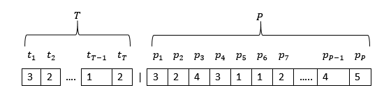
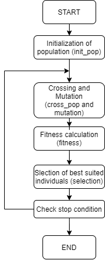

# Truck-Packing-Algorithm

## DETALIED DOCUMETATION

For very detailed documentation with full proces of tunning parameters of our algorithm click the link.

 [Detailed documantation in polish](https://github.com/TopRamen1/Truck-Packing-Algorithm/blob/main/Decription/Documentation_PL.pdf) 

## 1.	Problem description

  Truck packing algorithm is our implementation of genetical algorithm which is suposed to help us find a optimal solution for packing a set of trucks carrying given number o packages to right storages.
  
  Trucks:
  * We allow using different dypes of trucks
  * trucks have disctinct capacity and fuel consumption
  * One truck can travel to one storage only in one transport

  Packages:
  * each package has a given adress to witch it must be taken (address is a magazine id)
  * packages differ in weight
  * every package must be transported to correct destination

  Storages:
  * storages are located in different proximity to the starting storage which has an impact of cost of transport

## 2. Alogithm adaptation

### 1. Chromosome

For T trucks and P packages

First T slots in chromosome are representing trucks and values are magazines to which trucks are traveling.
	
Last P slots are packages and values are truck id’s off truck which is taking given package

### 2. Algorithm steps

Every step in our algorithm is implemented in a different function. Whhole proces of algorithm is like this: 

  

  

  
  
